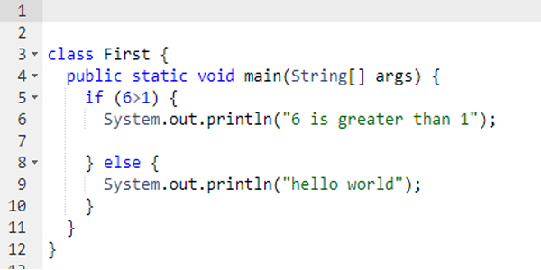
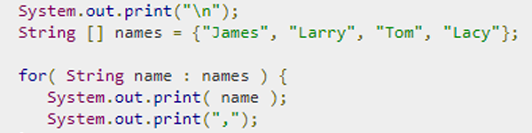

# Entry 3: If, elsif

## Boolean Operators
In java boolean operators are evaluated by specific orders. In other words ```!``` is evaluated first then ```&&``` and after that ```||```. These boolean operators are heavily used in if statements. If statements is something that will be used heavily in the project that I will create using java. Additionally relational operators ```<,>, ≥, ≤``` are used in if statements. Im very familiar with these operators and are fairly simple to use. I think I will use them quite a lot later on when I want to create an if statement that I want to be always true or false. Other than that I do not see another use for these operators.


## Decision Making

The syntax for if statements are a bit wacky and require a lot for curly brackets and commas. But at the same time the same can be said for anything in java. Java requires more attention to it's syntax.



Like in p5js theres if statements, ifelse statements, ifelse statements with if statements inside. These are called Nested if statements and there's also Switch statements. Switch statements will have their variables eventually change from true to false or vice versa. 

## Loops
Loops in java can be easily created using if statements. Just like in any other language they can be started by using a if statement that will always be true/false. Another kind of loop that can be created in java is printing out words or numbers in an array. In ruby there is each.do while in java its something like this



## Takeaways
One of the changes I made this week was actually recreating what I learned online on my own. I opened a repl and tried to create a for loop, and several if statements. Another thing that I did was google what specific words meant or did. An example is googling what ```String name: name``` really meant. Doing this made me fully understand the meaning of the syntax. I believe there's a different from understanding code and understanding code to the extent you could actually teach it. Going out of your way researching what every word in a line of code is a lot to do but can boost your comprehension overall.
