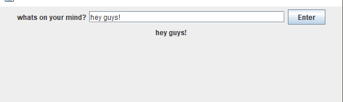

# Entry 6: MVP

## MVP
Deciding what to make was the most difficult part of the independent study process. I decided to make a forum website. This website allows a student to make an ‘original’ comment and then allow other students to respond to the original comment. So far the mvp allows the user to create an original comment. The next step is to allow add a reply functionality. Adding a reply functionality has been proven to be a hard task and requires a lot of time and learning. To find how to add a reply function I have made a static original comment and from there I will try to implement the reply functionality. 


#### The MVP



The user is asked to create a post. The way the mvp works is that in Java there is a function called a GUI. A gui is what makes the program at all visible. The program is created on a (java) window. Please read the comments below for clarification.

```java 
setVisible(true); //gui in java is set to false by default
		setSize(600,600); //size of the java window
		setDefaultCloseOperation(EXIT_ON_CLOSE); 

```

The user's input is grabbed from the text field to the label and then displayed at the bottom of the text field. This is how the user's input is transferred from the text field to the label. Please read the comments below for clarification.

```java
JLabel thoughtlabel = new JLabel();	//creating the label
JTextField thoughttext = new JTextField(30); //30 means length of field horizontally
// below shows how i made the text field 'listen' for the user's input.
thoughttext.addActionListener(new ActionListener() {
			public void actionPerformed(ActionEvent e) {
				String input = thoughttext.getText(); //grabs user text
				thoughtlabel.setText(input); //what ever it grabbed above is then set to the variable, thoughtlabel
			}
		});
```

## Takeaways 
What I’ve learned this week is to first know what to make before learning a language. Creating the MVP made me realize that almost everything I learned before has nothing to do with what i want to create. This is okay so far since what I do need to know can be learned pretty quick with oracle’s java resource website. Another thing I learned is that it's not so easy to create a project using another language. Currently I am using java as the backend and ReactJS as the frontend.

## Sources
[My Java Notes](https://docs.google.com/document/d/1kXbbE5X1wKu6clxek9bhsIswk4Cn--1wByHSp3vstBI/edit?usp=sharing)

[MVP raw code](http://txt.do/dfo0p)